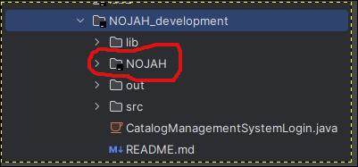
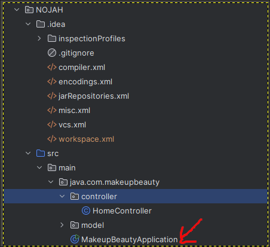
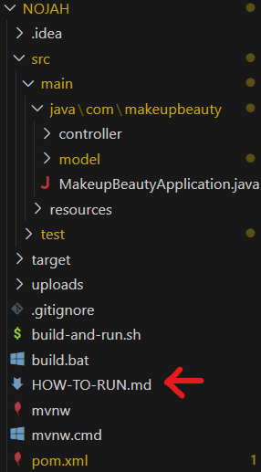

# Beauty Product Catalog Management System

Welcome to our Beauty Product Catalog Management System! This project helps you manage a catalog of beauty products easily. We’ve organized the code into different sections so you can see both our rough work-in-progress and the polished final version.

## Table of Contents

- [Overview](#overview)
- [Project Layout](#project-layout)
- [Key Features](#key-features)
- [Prerequisites](#prerequisites)
- [How to Get Started](#how-to-get-started)
- [Using the App](#using-the-app)

## Overview

Our system lets you add, search, update, and delete beauty products. It also includes a secure login system and will soon have a full-featured front-end GUI for a smooth, modern experience.

## Tech Stack
- Java 23
- Spring Boot
- Maven
- HTML/CSS (for frontend)


## Project Layout

- **NOJAH**
    - **What’s inside?** This folder contains the final version of the project with the integrated front-end GUI.
    - **Status:** In development; this is where the production-ready version is being built.

- **src**
    - **What’s inside?** This folder holds the early version of the backend without the GUI.
    - **Status:** In active development for testing and prototyping new features.

- **CatalogManagementSystemLogin.java**
    - **What’s inside?** This file has the login logic for the catalog system. It’s temporary and will be merged into the `src` folder once complete.
    - **Note:** Delete this file after its functionality has been integrated to keep things neat.

## Key Features

- **Easy Product Management:** Quickly add, update, or remove beauty products.
- **Smart Search & Filtering:** Find products by name, brand, category, or description effortlessly.
- **Secure Login:** Keep your catalog safe with user authentication.
- **CSV Import/Export:** Manage product data via CSV files.
- **Responsive Frontend:** Enjoy a modern GUI (in the NOJAH folder) designed for a great user experience.
- **Scalable Architecture:** Built with Spring Boot, it’s ready to grow with your needs.

## Prerequisites
Before you begin, ensure you have the following installed on your system:

### Java Development Kit (JDK)
- Version 23 (as specified in `pom.xml`).
- Download and install the JDK from Oracle or OpenJDK.
- Verify the installation:

```bash
java -version
```

### Apache Maven
- Used to build and manage dependencies.
- Download and install Maven from [Maven's official website](https://maven.apache.org/).
- Verify the installation:

```bash
mvn -v
```

### Git
- To clone the repository.
- Download and install Git from [Git's official website](https://git-scm.com/).
- Verify the installation:

```bash
git --version
```

## How to Get Started

1. **Clone the Repository**
   ```bash
   git clone https://github.com/AbdulMus/NOJAH_development.git
   ```

2. **Open the NOJAH folder within the root folder, NOJAH_development as a project in Intellij**
    

3. **Compile the Maven project and run MakeupBeautyApplication**
    

4. **Visit http://localhost:8080/ in your favourite browser and that's it!**

### Alternative File Start

1. **Check HOW-TO-RUN for more details**
    

## Using the App
[User Demo](https://youtu.be/5QlpfEppe0o)

[Admin Demo](https://youtu.be/UyOqst--AIU)
